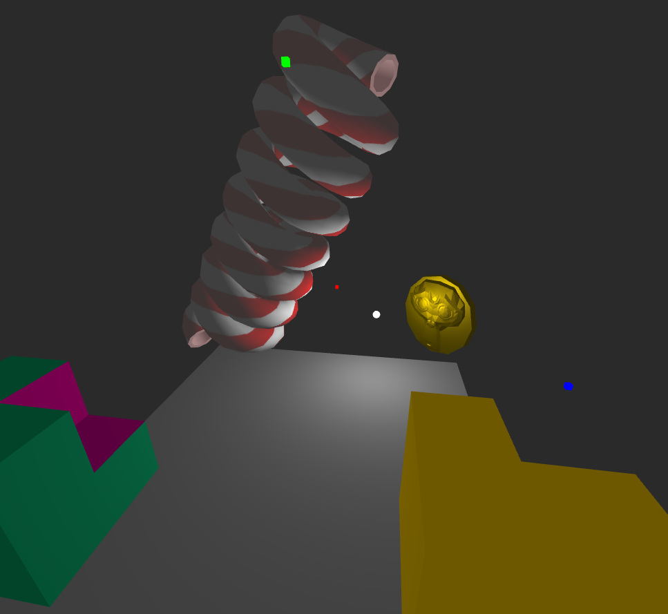

Example project for
[Gypsum](https://github.com/playkostudios/gypsum)

4 examples are included in this project:
- Simple cube CSG (`simple-cube-csg.js`): How to procedurally generate 2 cubes meshes with materials, and subtract them with Manifold
- Manual memory management (`manual-memory-management.js`): How to do the previous example, but without materials, reusing a cube mesh and manually managing the memory instead of using the `.mark()` method
- Extrusion (`extrusion.js`): A more complicated example. Shows how to procedurally generate extrusion meshes, how to use mesh hinting and how to apply multiple materials to procedural meshes
- Suzanne coin (`suzanne-coin.js`): How to convert an existing mesh into a MeshGroup usable by the library. Creates a coin with a monkey face on it

# Usage

1. Install the [Wonderland Engine editor](https://wonderlandengine.com/downloads/)
2. `npm install`
3. Open project (`gypsum-example.wlp`)
4. Package and run project
